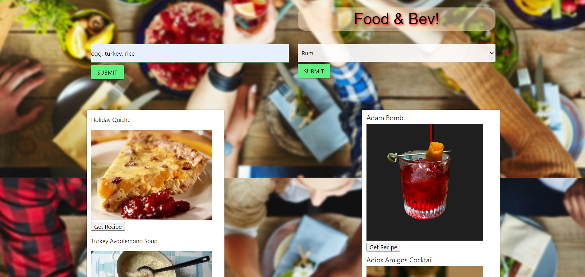
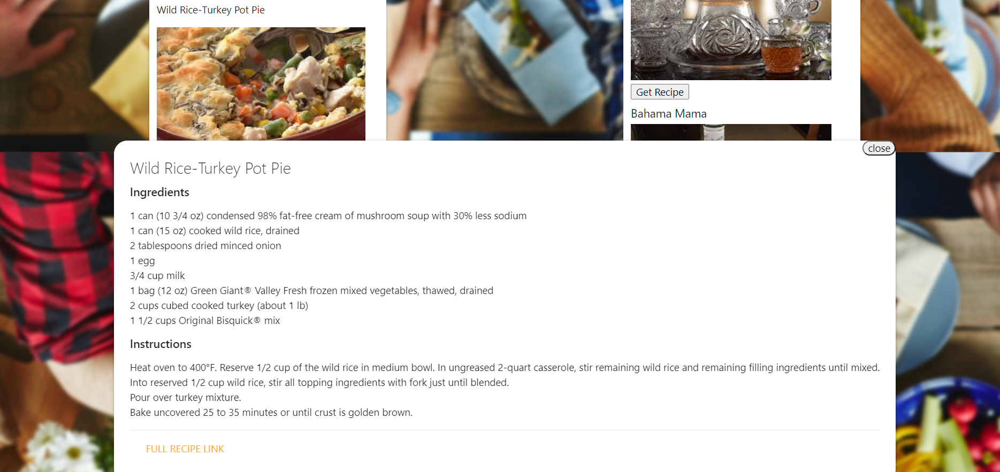
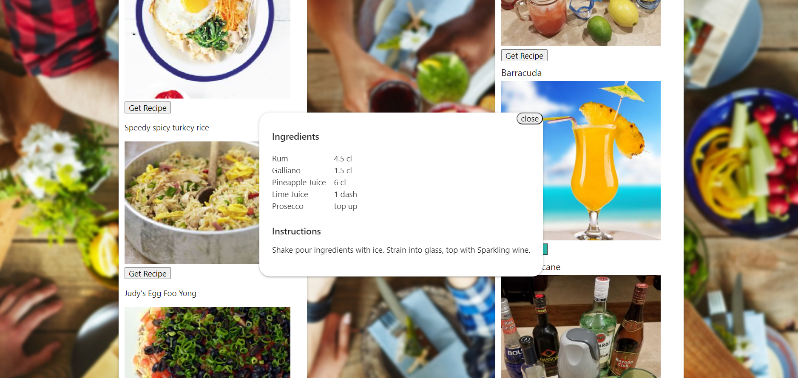

# Food & Bev

## Table of Contents
1. [Description](#description)
2. [Usage](#usage)
3. [Technologies](#technologies)
4. [Authors](#authors)
5. [Contributing](#contributing)
6. [License](#license)
7. [Questions](#questions)

## Description
Food & Bev is a website that offers a solution to the mismatched ingredients you already have in your kitchen. Discover easy recipes as well as creative cocktails you can make from the liquor in your bar. Food & Bev makes planning your meals with corresponding cocktails a simple and convenient process. 

## Usage
You will be presented with two search input fields: 
* one for food ingredients, which you have the option to enter up to three ingredients separated by a comma. 
* another for liquor, which gives you a drop-down menu with your alcohol options. 

Once you enter your selections, click Submit.

### Submit screen

Scroll through the list and when you see something tasty click the "Get Recipe" button for the food and drink recipes of your choice. 

### Food recipe card
You'll be presented with a recipe card with a full list of ingredients and instructions. Provided in the food recipe card there is a link to the original page the recipe came from for further detailed instructions and information.

### Cocktail recipe card

## Technologies
  
[spoonacular API](https://spoonacular.com/food-api)
 

[TheCocktailDB API](https://www.thecocktaildb.com/)

## Authors
| Name | GitHub  | LinkedIn |
| :--: | :-----: | :------: |
| Gene Garnes |  |  |
| Corey Moe |  |  |
| Rick Rocero |  |  |

## Contributing
Fork the git repository then contact the repository owner about pull requests. 

## Licensce
No license provided for this software.

## Questions
For questions, contact [Rick](https://github.com/rickrocero) or email me at rickrocero@gmail.com.