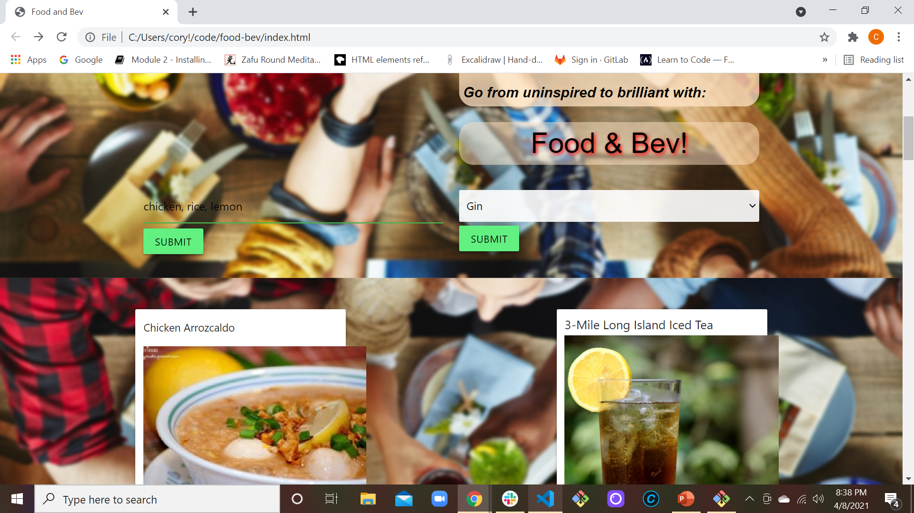

# food-bev
## Description
For this project the motivation was to solve the problem of what to make with all the mismatched ingredients in you kitchen. As well as what creative cocktails to make with the mismatched liquor you have in your bar or liquor cabinet. This project was built to make planning your meals with corresponding cocktails an easy and convenient process. Throughout making this Food and Bev project the value of utilizing different API's togother to make a cohesive webpages was the main lesson learned.
## Installation
To access the HTML, CSS and JS you can go to the GitHub repository for this project:
https://github.com/moecory11/food-bev
To access the live page you can go here:
https://moecory11.github.io/food-bev/
## Usage
When using this project you will be presented with two search input fields. One for food, which you have the option to enter up to three ingredients in. Another for liquor, which gives you a drop down tab with your alcohol options. Once you enter your selections, click submit, the title and pictures of recipes will be displayed. You then have the option to scroll though and click the "Get Recipe" button for the food and drink recipes of your choice. Once clicked it will display a recipe card with the ingredients and instructions for the food and drink items you chose. Provided in the food recipe card there is a link to the original page the recipe came from for further detailed instructions and information. Displayed in the screenshot is the results of a Food and Bev search.
    ```md
    
    ```
## Credits
This project was a collaborative effort between the three people whos GitHub profiles links are provided here:
https://github.com/rickrocero,
https://github.com/Gene16422,
https://github.com/moecory11
This project also used API's from: 
https://spoonacular/api/recipe-food-nutrition,
https://thecocktaildb/api/the-cocktail-db
## License
MIT License

Copyright (c) [2021] [FoodAndBev]

Permission is hereby granted, free of charge, to any person obtaining a copy
of this software and associated documentation files (the "Software"), to deal
in the Software without restriction, including without limitation the rights
to use, copy, modify, merge, publish, distribute, sublicense, and/or sell
copies of the Software, and to permit persons to whom the Software is
furnished to do so, subject to the following conditions:

The above copyright notice and this permission notice shall be included in all
copies or substantial portions of the Software.

THE SOFTWARE IS PROVIDED "AS IS", WITHOUT WARRANTY OF ANY KIND, EXPRESS OR
IMPLIED, INCLUDING BUT NOT LIMITED TO THE WARRANTIES OF MERCHANTABILITY,
FITNESS FOR A PARTICULAR PURPOSE AND NONINFRINGEMENT. IN NO EVENT SHALL THE
AUTHORS OR COPYRIGHT HOLDERS BE LIABLE FOR ANY CLAIM, DAMAGES OR OTHER
LIABILITY, WHETHER IN AN ACTION OF CONTRACT, TORT OR OTHERWISE, ARISING FROM,
OUT OF OR IN CONNECTION WITH THE SOFTWARE OR THE USE OR OTHER DEALINGS IN THE
SOFTWARE.
---